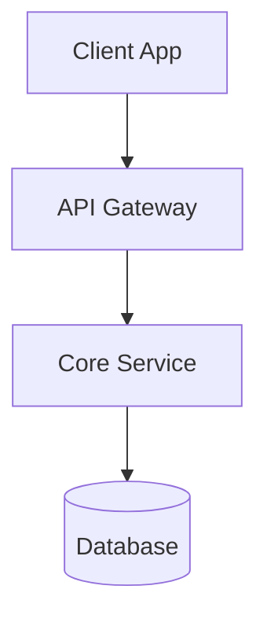

# Technical Plan: [FEATURE NAME]

**Status**: Draft
**Spec Ref**: `specs/[branch]/spec.md`
**Tech Stack**: [Filled by Agent based on User Input]

## 1. Executive Summary
[简述技术实现的核心思路。并明确前端、后端、数据库、关键中间件等的选型，可参考下面的格式]

**Language/Version**: [e.g., Python 3.11, Swift 5.9, Rust 1.75 or NEEDS CLARIFICATION]  
**Primary Dependencies**: [e.g., FastAPI, UIKit, LLVM or NEEDS CLARIFICATION]  
**Storage**: [if applicable, e.g., PostgreSQL, CoreData, files or N/A]  
**Testing**: [e.g., pytest, XCTest, cargo test or NEEDS CLARIFICATION]  
**Target Platform**: [e.g., Linux server, iOS 15+, WASM or NEEDS CLARIFICATION]
**Project Type**: [single/web/mobile - determines source structure]  
**Performance Goals**: [domain-specific, e.g., 1000 req/s, 10k lines/sec, 60 fps or NEEDS CLARIFICATION]  
**Constraints**: [domain-specific, e.g., <200ms p95, <100MB memory, offline-capable or NEEDS CLARIFICATION]  
**Scale/Scope**: [domain-specific, e.g., 10k users, 1M LOC, 50 screens or NEEDS CLARIFICATION]

## 2. Architecture Decisions (ADR)
> **关键决策记录**: 记录我们在技术选型上的权衡。

| Decision        | Selected Option | Rationale (Why)              | Alternatives Considered        |
| :-------------- | :-------------- | :--------------------------- | :----------------------------- |
| [e.g. Database] | [PostgreSQL]    | [需支持复杂的关系查询和事务] | [MongoDB (不支持强一致性事务)] |
| [e.g. Auth]     | [NextAuth.js]   | [开箱即用的 OAuth 支持]      | [自研 JWT]                     |

## 3. High-Level Architecture
> 系统组件交互图。



## 4. Implementation Strategy (Mapped to Spec)

> 针对 Spec 中的每个 Story，描述具体的技术实现方案。（下方列出的每个Story中的点仅供参考，不是必须按照这个来编写，以具体的Story情况为准）

**注意：这里是技术实现方案，还没有到代码实现步骤，不要包含具体代码。**

### Story 1: [Title from Spec]

- **Frontend Components**:
  - State Management: [Strategy]
  - ...
- **Backend Logic**:
  - API Endpoint: `[Method] [Path]` (Ref: `api.md`)
  - Validation: [Zod/Joi]
- **Testing Strategy**:
  - Unit: [What to mock]
  - Integration: [Key flow to test]

...

### Story 2: [Title]

...

## 5. Security & Scalability

- **Security**: [Auth scopes, Input sanitization, etc.]
- **Scalability**: [Caching strategies, DB indexing, etc.]


## 6. Project Structure

<!--
  将下面的占位符树替换为该功能的具体布局。删除未使用的选项，并使用实际路径（例如，apps/admin、packages/something）扩展所选结构。交付的计	划不得包含选项
-->

```text
# [REMOVE IF UNUSED] Option 1: Single project (DEFAULT)
app/
├── src/
│   ├── models/
│   ├── services/
│   ├── cli/
│   └── lib/
└── tests/
    ├── contract/
    ├── integration/
    └── unit/

# [REMOVE IF UNUSED] Option 2: Web application (when "frontend" + "backend" detected)
app/
├── backend/
│   ├── src/
│   │   ├── models/
│   │   ├── services/
│   │   └── api/
│   └── tests/
└── frontend/
    ├── src/
    │   ├── components/
    │   ├── pages/
    │   └── services/
    └── tests/

# [REMOVE IF UNUSED] Option 3: Mobile + API (when "iOS/Android" detected)
app/
├── api/
│   └── [same as backend above]
└── ios/ or android/
    └── [platform-specific structure: feature modules, UI flows, platform tests]
```

结构决策：[记录所选结构并参考上面捕获的实际目录]

